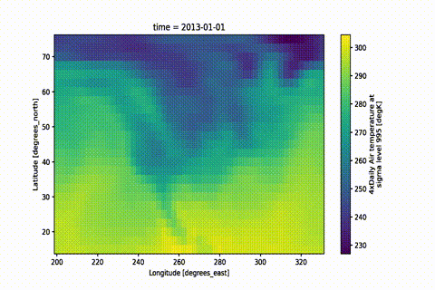

# xmovie
[](https://github.com/jbusecke/xmovie/actions)
[](https://xmovie.readthedocs.io/en/latest/)
[](https://codecov.io/gh/jbusecke/xmovie)
[](https://opensource.org/licenses/MIT)
[](https://zenodo.org/badge/latestdoi/124968397)
[](https://anaconda.org/conda-forge/xmovie)
[](https://anaconda.org/conda-forge/xmovie)
[](https://badge.fury.io/py/xmovie)

*A simple way of creating beautiful movies from [xarray](https://xarray.pydata.org) objects.*

With ever-increasing detail, modern scientific observations and model results
lend themselves to visualization in the form of movies.

Not only is a beautiful movie a fantastic way to wake up the crowd on a Friday
afternoon of a weeklong conference, but it can also speed up the discovery
process, since our eyes are amazing image processing devices.

This module aims to facilitate movie rendering from data objects based on
[xarray objects](https://xarray.pydata.org/en/stable/user-guide/data-structures.html).

Xarray already provides [a way](https://xarray.pydata.org/en/stable/user-guide/plotting.html)
to create quick and beautiful static images from your data using [Matplotlib](https://matplotlib.org/).
[Various packages](https://matplotlib.org/mpl-third-party/#animations)
provide facilities for animating Matplotlib figures.

But it can become tedious to customize plots, particularly when map projections are used.

The main aims of this module are:

- Enable quick but high-quality movie frame creation from existing xarray
  objects with preset plot functions -- create a movie with only 2 lines of code.
- Provide high quality, customizable presets to create stunning visualizations with minimal setup.
- Convert your static plot workflow to a movie with only a few lines of code,
  while maintaining all the flexibility of [xarray](https://xarray.pydata.org)
  and [Matplotlib](https://matplotlib.org).
- Optionally, use [Dask](https://dask.org) for parallelized frame rendering.

## Installation

The easiest way to install `xmovie` is via `conda`:
```
conda install -c conda-forge xmovie
```

You can also install via `pip`:
```
pip install xmovie
```

## Documentation

Check out the examples and API documentation at <https://xmovie.readthedocs.io>.

## Quickstart

High-quality movies and gifs can be created with only a few lines
```python
import xarray as xr
from xmovie import Movie

ds = xr.tutorial.open_dataset('air_temperature').isel(time=slice(0,150))
mov = Movie(ds.air)
mov.save('movie.mp4')
```
Saving a `.gif` is as easy as changing the filename:
```python
mov.save('movie.gif')
```
That is it! Now pat yourself on the shoulder and enjoy your masterpiece.



> The GIF is created by first rendering a movie and then converting it to a GIF.
> If you want to keep both outputs you can simply do `mov.save('movie.gif', remove_movie=False)`
