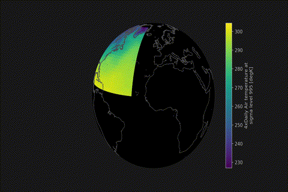
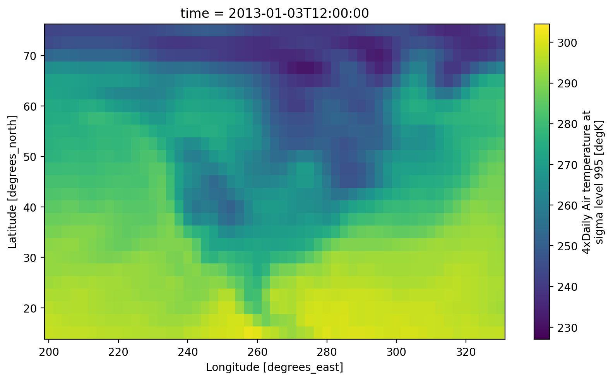
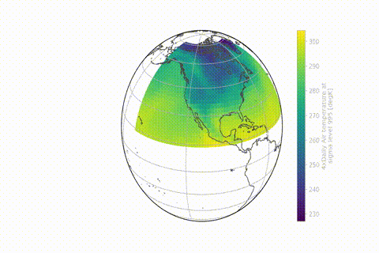
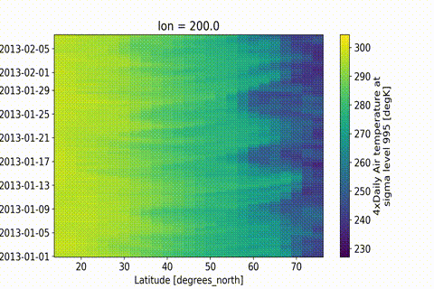
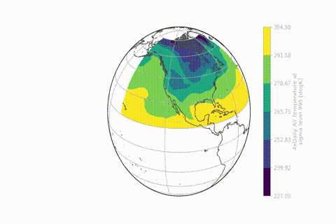
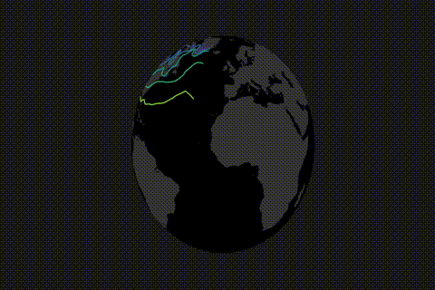
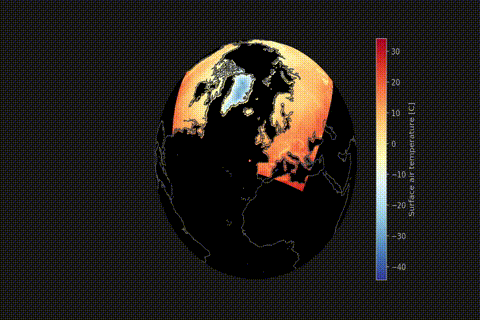
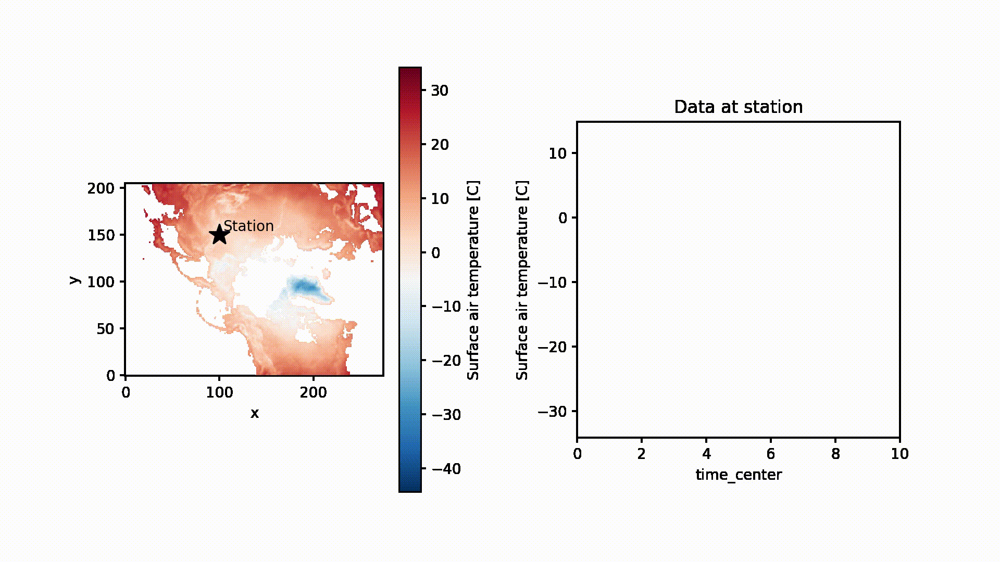

# xmovie
[](https://github.com/jbusecke/xmovie/actions)
[](https://codecov.io/gh/jbusecke/xmovie)
[](https://opensource.org/licenses/MIT)
[](https://zenodo.org/badge/latestdoi/124968397)
[](https://badge.fury.io/py/xmovie)
[](https://anaconda.org/conda-forge/xmovie)

A simple way of creating beautiful movies from [xarray](https://github.com/pydata/xarray) objects.

With ever increasing detail, modern scientific observations and model results
lend themselves to visualization in the form of movies.

Not only is a beautiful movie a fantastic way to wake up the crowd on a Friday
afternoon of a weeklong conference, but it can also speed up the discovery
process, since our eyes are amazing image processing devices.

This module aims to facilitate movie rendering from data object based on
[xarray](https://github.com/pydata/xarray) objects.

Xarray already provides a way to create quick and beautiful static images from your data.
[animatplot](https://github.com/t-makaro/animatplot) works towards animating these 'standard' xarray plots.

But it can become tedious to customize plots, particularly when map projections are used.

The main aims of this module are:

- Enable quick but high quality movie frame creation from existing xarray
objects with preset plot functions - create a movie with only 2 lines of code.
- Provide high quality, customizable presets to create stunning visualizations with minimal setup.
- Convert your static plot workflow to a movie with only a few lines of code, while maintaining all the flexibility of [xarray](https://github.com/pydata/xarray) and [matplotlib](https://matplotlib.org/).


<!-- - Use [dask](https://github.com/dask/dask) for computationally efficient
frame rendering.-->

## Installation

### Conda
The easiest way to install `xmovie` is via conda:
`$ conda install -c conda-forge xmovie`

### Pip
You can also install via pip:
`$ pip install xmovie`

### Install latest version from github
If you want to install from source, simply run `pip install git+https://github.com/jbusecke/xmovie.git`

>If you dont have [ssh keys](https://help.github.com/en/articles/adding-a-new-ssh-key-to-your-github-account) set up, you can use `$ git clone https://github.com/jbusecke/xmovie.git` and enter your github password.

## Quickstart
Making high quality movies and gifs can be created with only a few lines

```python
import xarray as xr
from xmovie import Movie

ds = xr.tutorial.open_dataset('air_temperature').isel(time=slice(0,150))
mov = Movie(ds.air)
mov.save('movie.mp4')
```

Saving a `.gif` is as easy as changing the filename:
```python
mov.save('movie.gif')
```
That is it! Now pat yourself on the shoulder and enjoy your masterpiece.


> The gif is created by first rendering a movie and then converting it to a gif.
If you want to keep both outputs you can simply do `mov.save('movie.gif', remove_movie=False)`

<!-- ## Presets for quick movies
Using the presets of __xmovie__ making a movie is very easy: -->

## Preview movie frames
Preview single frames in the movie with the `Movie.preview` function:
```
# preview 10th frame
mov.preview(10)
```


## Plot presets
xmovie provides several presets to enable quick creation of animated vizualizations
```python
from xmovie.presets import rotating_globe
# specify custom plotfunctions (here a preset from xmovie)
mov = Movie(ds.air, plotfunc=rotating_globe)
mov.save('movie_rotating.gif', progress=True)
```


## Frame dimension
By default, the movie passes through the `"time"` dimension of the DataArray, but
this can be easily changed with the `framedim` argument:
```python
mov = Movie(ds.air, framedim='lon')
mov.save('lon_movie.gif')
```


## Modify plots
The preset plot-functions each have a unique set of keyword arguments for custom looks, but they all support the `xarray` plotting modes via the `plotmethod` keyword.
For a more detailed demonstration see [this](First_Steps.ipynb) notebook.
<!-- ```
from xmovie.presets import rotating_globe_dark  # the default preset
mov = Movie(ds.air, rotating_globe_dark, plotmethod='contourf', coastline=False, land=True)
mov.save('movie_contf.gif')
```


```
mov = Movie(ds, rotating_globe_dark, plotmethod='contour', coastline=False, land=True)
mov.save('movie_cont.gif')
```


```
ds = xr.tutorial.open_dataset('rasm').Tair

# Interpolate time for smoother animation
ds['time'].data = np.arange(len(ds['time']))
ds = ds.interp(time=np.linspace(0,10, 60))

mov = Movie(ds, rotating_globe_dark,
            cmap='RdYlBu_r',
            x='xc',
            y='yc', #accepts keyword arguments from the xarray plotting interface
            lat_start=45, # Custom keywords from `rotating_globe_dark
            lon_rotations=0.2)
mov.save('movie_rasm.gif')
```

 -->


### Custom Plots
You can customize any plot based on an xarray data structure and a 'frame-dimension' (usually time, or another dimension that will evolve with time in the movie).

Take this example:

```
# some awesome static plot
import matplotlib.pyplot as plt

ds = xr.tutorial.open_dataset('rasm').Tair


fig = plt.figure(figsize=[10,5])
tt = 30

station = dict(x=100, y=150)
ds_station = ds.sel(**station)

(ax1, ax2) = fig.subplots(ncols=2)
ds.isel(time=tt).plot(ax=ax1)
ax1.plot(station['x'], station['y'], marker='*', color='k' ,markersize=15)
ax1.text(station['x']+4, station['y']+4, 'Station', color='k' )
ax1.set_aspect(1)
ax1.set_facecolor('0.5')
ax1.set_title('');

# Time series
ds_station.isel(time=slice(0,tt+1)).plot.line(ax=ax2, x='time')
ax2.set_xlim(ds.time.min().data, ds.time.max().data)
ax2.set_ylim(ds_station.min(), ds_station.max())
ax2.set_title('Data at station');

fig.subplots_adjust(wspace=0.6)
```


All that is needed to wrap this into a function with the signature `func(ds, fig, timestamp, framedim, **kwargs)`, where `ds` is an xarray Dataset or DataArray, `fig` is a `matplotlib.figure` object and `timestamp` is an integer which indicates the movie frame.

```
def custom_plotfunc(ds, fig, tt, framedim="time"):
    # Define station location for timeseries
    station = dict(x=100, y=150)
    ds_station = ds.sel(**station)

    (ax1, ax2) = fig.subplots(ncols=2)

    # Map axis
    # Colorlimits need to be fixed or your video is going to cause seizures.
    # This is the only modification from the code above!
    ds.isel({framedim:tt}).plot(ax=ax1, vmin=ds.min(), vmax=ds.max(), cmap='RdBu_r')
    ax1.plot(station['x'], station['y'], marker='*', color='k' ,markersize=15)
    ax1.text(station['x']+4, station['y']+4, 'Station', color='k' )
    ax1.set_aspect(1)
    ax1.set_facecolor('0.5')
    ax1.set_title('');

    # Time series
    ds_station.isel({framedim:slice(0,tt+1)}).plot.line(ax=ax2, x=framedim)
    ax2.set_xlim(ds[framedim].min().data, ds[framedim].max().data)
    ax2.set_ylim(ds_station.min(), ds_station.max())
    ax2.set_title('Data at station');

    fig.subplots_adjust(wspace=0.4)

mov_custom = Movie(ds, custom_plotfunc)
mov_custom.save('movie_custom.gif')
```

