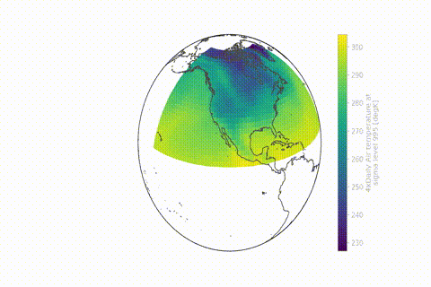

.. xmovie documentation master file, created by
   sphinx-quickstart on Thu Mar 15 20:42:05 2018.
   You can adapt this file completely to your liking, but it should at least
   contain the root `toctree` directive.

xmovie: movies from `xarray`_ objects
=====================================

.. toctree::
   :maxdepth: 2
   :caption: For users
   :hidden:

   examples
   api
   whats-new
   GitHub repository <https://github.com/jbusecke/xmovie>

   Rotating globe :ref:`preset <api:Presets>` example.
   See :ref:`the quickstart <examples/quickstart:modifying plots>`.

.. _xarray: https://xarray.pydata.org
